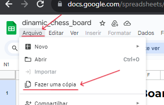

# ♟️Tabuleiro de Xadrez Dinâmico

Este foi meu primeiro contato com o Google Apps Script para automatizar funções no Google Sheets. Este projeto gera um tabuleiro de xadrez personalizado com base no número de colunas e linhas inserido pelo usuário.

## 🛠️Experimente você mesmo

  
[Clique aqui para acessar o projeto no Google Sheets](https://docs.google.com/spreadsheets/d/1jH_izBxsohrLAcVXECRMXOVwnOVWjh9O-QIH-nd4P4I/edit?usp=sharing)
 
_(Para os scripts funcionarem corretamente, crie uma cópia na sua própria pasta do Google Drive)_
 
[Aprenda como dar permissões à sua conta para a execução dos scripts](https://github.com/gudaoliveira/apps_scripts_permissions)
  
 

---

## 📸Captura de Tela

  

## 💻Como funciona?

- Simplesmente altere os valores nas células **"D2"** e **"H2"** para o número de linhas e colunas do tabuleiro, respectivamente, e clique no botão **"GERAR"**.
- Isso é tudo, agora espere a planilha imprimir o tabuleiro.
- Observe que o botão **GERAR** deve ter o script _[start.gs](https://github.com/gudaoliveira/dinamic_chess_board/blob/main/start.gs)_ atribuído para funcionar.

## 🧠Problemas Conhecidos
Este é uma ótima peça de portifólio para mim, mas poderia ser uma ótima peça para nós! Portanto, sinta-se à vontade para contribuir de qualquer maneira que você ache que melhoraria o projeto.

- Uma coisa que observei é que com valores grandes, a planilha pode ficar um pouco lenta, então, isso seria interessante a se melhorar.
- Além disso, talvez adicionar mais opções de formatação seria uma boa ideia.

Feito com 💞 no Brasil💚💛
