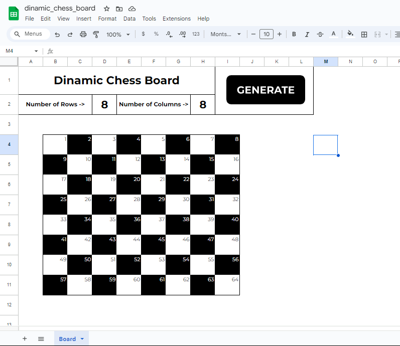

# ♟️Dinamic Chess Board
This was my first contact with Google Apps Script to automate functions on Google Sheets. This project generates a custom chess board based on the number of columns and rows inputted by the user

## 🛠️Give it a try for yourself

  
[Click here to access the project on Google Sheets](https://docs.google.com/spreadsheets/d/1jH_izBxsohrLAcVXECRMXOVwnOVWjh9O-QIH-nd4P4I/edit?usp=sharing)
 
_(For the scripts to work properly create a copy on your own Drive folder)_
 
[Learn how to give to your account permissions for the scripts to run](https://github.com/gudaoliveira/apps_scripts_permissions)
  
 

---

## 📸Screenshot

  

## 💻How does it work?

- Simply just change the values on the **"D2"** and **"H2"** cell for the numbers of Rows and Columns of the board, respectively and click it on the **"GENERATE"** button.
- That's it, now just wait for the sheet to print the board
- Note that the **GENERATE** button must have the _[start.gs](https://github.com/gudaoliveira/dinamic_chess_board/blob/main/start.gs)_ script assigned to work

## 🧠Known Issues
This is a good piece of portifolio to me, but it could be a great piece of portifolio for us! So feel free to contribute in any way that you might think i would enhance the project

- One thing that i notice was that with large values the sheet can be a little slow, so, that's something that would be good to improve
- Besides that maybe adding more formatting options would be a good idea

Made with 💞 in Brasil💚💛

